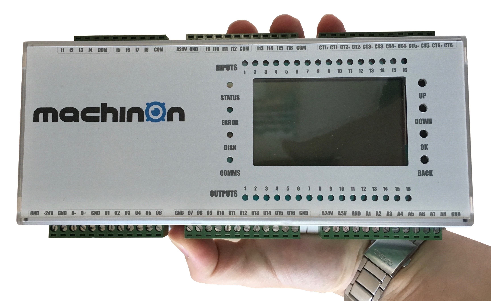

# machinon
Interface and control documentation for machinon 

## Documentation
* [Hardware Specification](documentation/hardware_spec.md)
* [Hardware Description](documentation/hardware_description.md)
* [machinon data messages](documentation/data_messages.md)
* [machinon configuration messages](documentation/config_messages.md)

## Install guides
* [Raspberry Pi Software Setup I : Machinon Install Guide](documentation/machinon_install_guide.md)
* [Raspberry Pi Software Setup II: Re:Machinon Access Install Guide](documentation/remachinon_access_install_guide.md)

